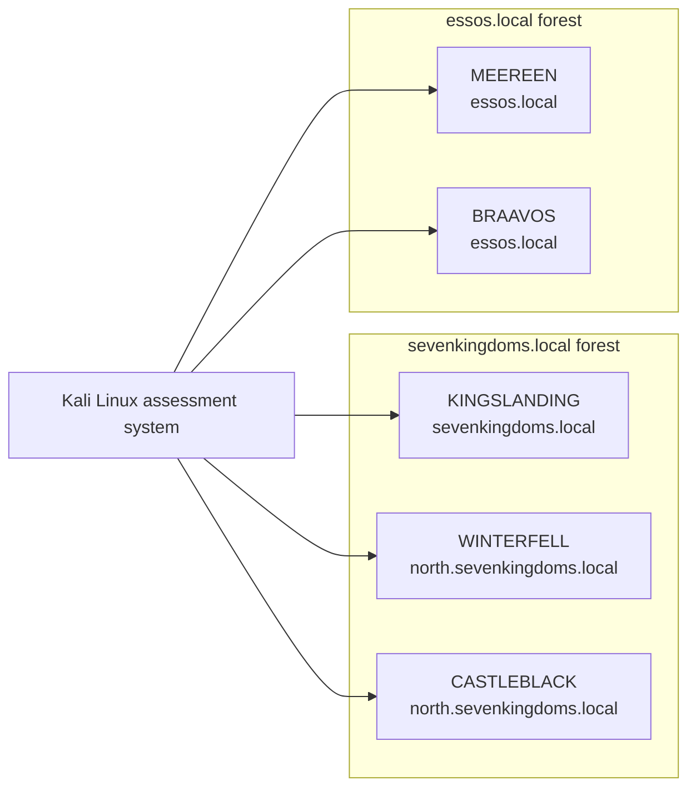

# GOAD Active Directory Security Assessment

This repository documents an Active Directory security assessment performed in the Game of Active Directory lab.

The assessment follows the development of an attack path from unauthenticated discovery through credential access, lateral movement, privilege escalation, domain compromise, Golden Ticket abuse, Active Directory Certificate Services misconfigurations, Kerberos delegation, and command-and-control operations with Sliver.

Each section explains what was tested, why the technique worked, what evidence confirmed the result, the resulting security impact, and how the weakness could be detected or mitigated.

## Lab environment

The assessment was performed against the full GOAD environment deployed through **Ludus**.

The environment contains:

- Five Windows virtual machines
- Two Active Directory forests
- Three domains
- Multiple intentionally vulnerable authentication, trust, certificate, and delegation configurations
- A separate Kali Linux assessment system

## What this project demonstrates

The assessment includes practical work involving:

- Active Directory and SMB discovery
- LDAP, RPC, and Kerberos enumeration
- Password-policy analysis
- AS-REP roasting and Kerberoasting
- Controlled password spraying
- LLMNR and NBT-NS poisoning
- NetNTLMv2 credential capture and offline recovery
- SMB share enumeration
- Credential dumping and pass-the-hash
- LSASS credential access
- Privilege escalation and domain compromise
- Golden Ticket creation and validation
- Cross-domain trust abuse
- Active Directory Certificate Services misconfigurations
- Constrained, unconstrained, and resource-based constrained delegation
- Command-and-control operations with Sliver

## Assessment path

### 00 — Lab environment and scope

[Architecture, rules of engagement, methodology, assumptions, and limitations](docs/00-lab-environment-and-scope.md)

### 01 — Discovery and enumeration

[Host discovery, domain identification, SMB configuration, anonymous enumeration, password-policy analysis, and Kerberos username discovery](docs/01-discovery-and-enumeration.md)

### 02 — Initial credential access

[AS-REP roasting, controlled password spraying, credential validation, and authenticated directory enumeration](docs/02-initial-credential-access.md)

### 03 — Credential access and lateral movement

[Kerberoasting, NetNTLMv2 capture, password recovery, share access, and movement between accessible systems](docs/03-credential-access-and-lateral-movement.md)

### 04 — Privilege escalation and domain compromise

[Privileged group discovery, credential dumping, pass-the-hash, LSASS access, and an alternative PrintNightmare escalation path](docs/04-privilege-escalation-and-domain-compromise.md)

### 05 — Golden Ticket and cross-domain trust abuse

[Domain SID discovery, `krbtgt` compromise, ticket creation, validation, persistence implications, and cross-domain impact](docs/05-golden-ticket-and-cross-domain-trust-abuse.md)

### 06 — Active Directory Certificate Services

[AD CS enumeration and assessment of ESC1, ESC2, ESC3, ESC4, ESC6, and ESC8 conditions](docs/06-adcs/README.md)

### 07 — Kerberos delegation

[Constrained, unconstrained, and resource-based constrained delegation](docs/07-kerberos-delegation.md)

### 08 — Command and control with Sliver

[Infrastructure setup, implant operation, session management, post-exploitation, cleanup, and defensive observations](docs/08-sliver/README.md)

### 09 — Findings and defensive summary

[The complete attack path, principal findings, defensive priorities, and lessons learned](docs/09-findings-and-defensive-summary.md)

## Documentation approach

Each chapter separates:

- The starting position
- The security question
- The method used
- The evidence collected
- The resulting access or impact
- Detection opportunities
- Recommended mitigations
- Relevant MITRE ATT&CK techniques

Large terminal outputs, credential sets, ticket files, and repetitive tool output have been reduced to the evidence required to support each conclusion.

## Tooling note

The original assessment used **CrackMapExec** during several stages.

Because **NetExec** is the actively maintained continuation of the same project, the documentation preserves the commands used during the assessment while also showing the current NetExec equivalent where useful.

## Scope and ethics

All activity documented here was performed in an intentionally vulnerable and isolated lab.

The material is intended for education, defensive understanding, professional development, and authorised security testing. It must not be used against systems without explicit permission.

See [DISCLAIMER.md](DISCLAIMER.md) for the complete usage statement.

## Attribution

GOAD was created by Orange Cyberdefense.

This repository contains my own assessment notes, analysis, evidence, and reporting. It does not redistribute the GOAD infrastructure or claim ownership of the original lab

