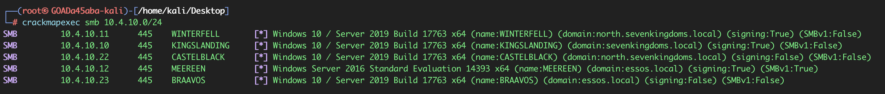
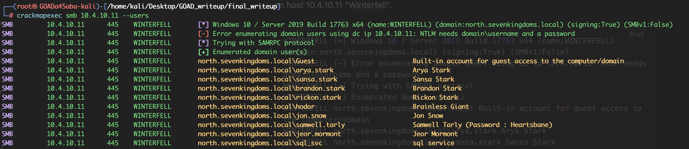
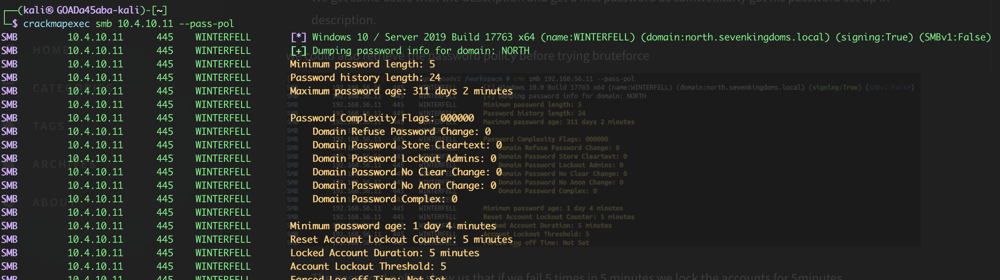
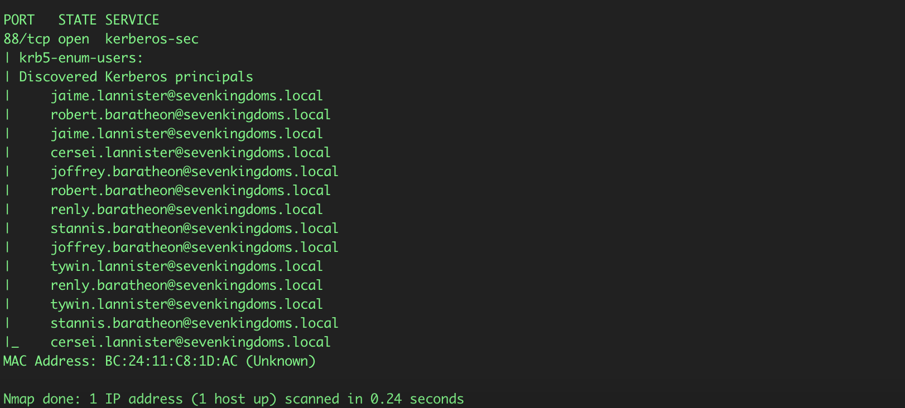
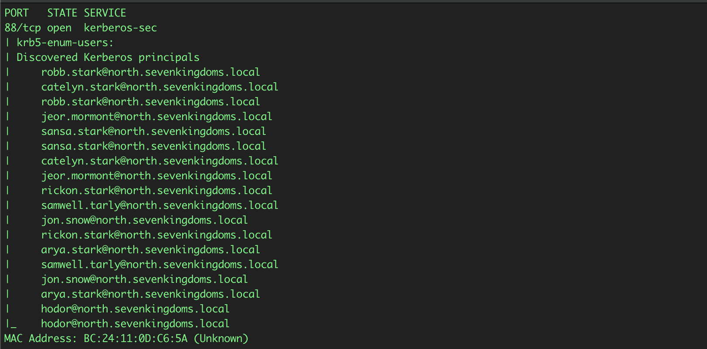

# Discovery and Enumeration

## Objective

The first phase established which Windows systems were reachable, how they were organised into domains, and what information could be obtained without valid credentials.

## Starting position

- Network access to the isolated `10.4.10.0/24` lab subnet
- No usernames or passwords
- No confirmed domain or host inventory

## SMB host discovery

The original assessment used **CrackMapExec** to identify SMB-speaking systems:

```bash
# Command used during hte original assessment
crackmapexec smb 10.4.10.0/24

# Current NetExec equivalent
nxc smb 10.4.10.0/24
```

The scan identified five Windows systems across three domains:

- `10.4.10.10` — `KINGSLANDING` — `sevenkingdoms.local`
- `10.4.10.11` — `WINTERFELL` — `north.sevenkingdoms.local`
- `10.4.10.12` — `MEEREEN` — `essos.local`
- `10.4.10.22` — `CASTELBLACK` — `north.sevenkingdoms.local`
- `10.4.10.23` — `BRAAVOS` — `essos.local`

The output also indicated that SMB signing was not required on `CASTELBLACK` and `BRAAVOS`. That did not provide access by itself, but it identified systems that could become relevant to NTLM relay tsting later in the assessment.



## Anonymous account enumeration

Anonymous user enumeration was attempted against the discovered hosts. Most systems rejected the request, but `WINTERFELL` returned domain account information without valid credentials.

```bash
# Original syntax
crackmapexec smb 10.4.10.11 --users

# Current equivalent
nxc smb 10.4.10.11 --users
```

The successful result indicated that anonymous RPC/SAMR access exposed directory infromation. More importantly, one accoutn description contained a plaintext lab password for `samwell.tarly`.

```text
samwell.tarly:<PASSWORD_DISCLOSED_IN_ACCOUNT_DESCRIPTION>
```


This was the first direct credential exposure in the assessment. The weakness was not the enumeration tool itself; it was the combination of anonymous directory access and sensitive information stored in a user-controlled descriptive field.

## Group enumeration

`enum4linux` was used to retrieve domain groups and map selected users to them:

```bash
enum4linux 10.4.10.11
```

The output exposed standard domain groups as well as lab-specific groups such as `Stark`, `Night Watch`, and `Mormont`.

This provided context for the account structure and helped prioritise users for later authentication testing.

The complete user and group is intentionally omitted. The important result was that unauthenticated access revealed enough naming and group information to build a credible user list.

## Password-policy retrieval

Before any password spraying, the domain password policy was queried:

```bash
# Original syntax
crackmapexec smb 10.4.10.11 --pass-pol

# Current equivalent
nxc smb 10.4.10.11 --pass-pol
```

The relevant policy values were:

```text
Account lockout threshold:	5 attempts
Lockout counter reset:		5 minutes
Lockout duration:			5 minutes
```



Retrieving the policy changed how later authentication testing was performed. Rather than sending repeated attempts against individual accounts, the assessment used a small, controlled password-spray set designed to remain below the known threshold.

## Kerberos username enumeration

The usernames returned from `WINTERFELL` showed a consistent `firstname.lastname` convention and a Game of Thrones naming theme. A larger candidate list was generated from publicly available character names and normalised into that format.


```bash
curl -s https://www.hbo.com/game-of-thrones/cast-and-crew | grep 'href="/game-of-thrones/cast-and-crew/' | grep -o 'aria-label="[^"]*"' | cut -d '"' -f 2 | awk '{
      if ($2 == "") print tolower($1);
      else print tolower($1) "." tolower($2)
    }'  > usernames.txt
```
This was a lab-specific way to create realistic candidates. In a real assessment, username generation would need to stay within the agreed rules of engagement and use approeved sources.

Kerberos responses were then used to distinguish valid principals from unknown accounts:

```bash
nmap -p 88 --script krb5-enum-users --script-args="krb5-enum-users.real='sevenkingdoms.local',userdb=usernames.txt" 10.4.10.10
```



For the child domain, the real must match the target domain:

```bash
nmap -88 --script krb5-enum-users --script-args="krb5-enum-users.real='north.sevenkingdoms.local',userdb=usernames.txt" 10.4.10.11
```



The same method was applied to `essos.local` through `MEEREEN`.

## Result

The discovery phase produced:

- A confirmed inventory of five Windows systems
- Three domain names across two forests
- SMB-signing observations relevant to later relay analysis
- Anonymous user and group enumeration on`WINTERFELL`
- One plaintext lab password exposed in an account description
- The domain lockout policy
- Additional valid usernames discovered through Kerberos responses

This was enough information to move from unauthenticated discovery to targeted credential testing.

## Security impact

Anonymous directory access reduces the amount of uncertainty an attacker must overcome. When it is compbined with descriptive fields containing passwords, it can provide both a target list and an initial credential without requiring exploitation of a software vulnerability.

## Detection opportunities

Defenders should review:

- Anonymous SAMR and RPC queries to domain controllers
- Repeated Kerberos authentication requests for many different usernames from one source
- SMB enumeration from systems that are not administrative workstations
- Changes to accoutn description fields
- Sensitive words or password-like values stored in directory attributes

## Mitigation

- Prevent anonymous account and group enumeration where it is not required
- Remove credential and operational secrets from account descriptions and other directory attributes
- Require SMB signing where operationally possible
- Monitor high-volume Kerberos principal discovery
- Use naming and lockout policies as one control among several, not as the primary defence against credential attacks

## MITRE ATT&CK mapping

- `T1046` - Network Service Discovery
- `T1087.002` - Domain Accoutn Discovery
- `T1069.002` - Domain Groups Discovery
- `T1201` - Password Policy Discovery

## Key takeaway

The first meaningful weakness was not an advanced exploit.

Basic access-control and information-handling problems exposed the domain structure, user population, password policy, and an initial credential.

That information made every later stage more targeted and less noisy.

## Navigation

[Previous: Lab environment and scope](00-lab-environment-and-scope.md) | [Assessment index](../README.md) | [Next: Initial credential access](02-initial-credential-access.md)