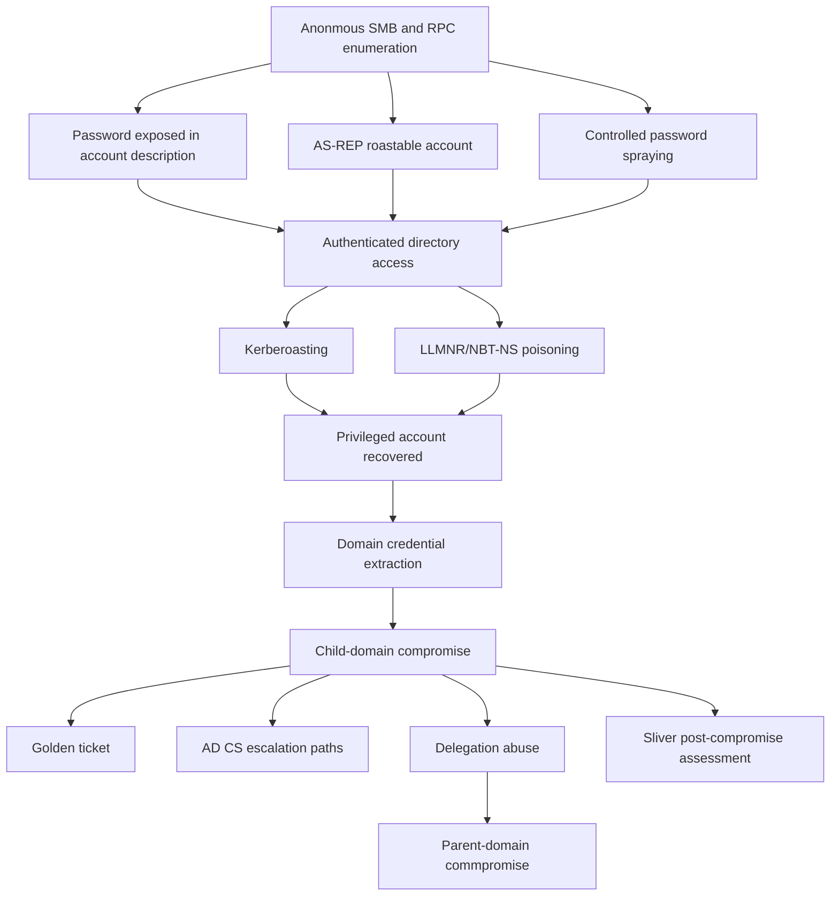

# Findings and Defensive Summary

## Executive summary

The GOAD assessment demonstrated how several ordinary AD weaknesses could be chained into full domain and foresst-level compromise.

The initial access did not depend on a zero-day or a complex exploit. Anonymous account enumeration exposed usernames and group information, an account description contained a plaintext password, one accoutn did not require Kerberos pre-authentication and another used a predictable password.

Those condiitons establihsed authenticated access with relatively little noise.

The attack path then expanded thorugh Kerberoasting, captured NetNLMv2 authentication, exposed share content, administrative credential reuse, domain credential extraction, and LSASS accent.

Compromise of the child domain `krbtgt` key enabled a validated Golden Ticket. AD CS and delegation misconfigurations provided additional independent escalation paths, including a confirmed unconstrained-delegation route into the parent domain.

## Attack-path progression

## Principal findings

### Anonymous account and policy exposure

`WINTERFELL` exposed domain users, groups, and password-policy iniformation without valid credentials. This reduced uncertainty and allowed later credential testing to be targeted and lockout-aware.

**Priority:** High

**Recommendation:** Restrict anonymous SAMR/RPC access and monitor enumeration from non-administrative systems.

### Credentials stored in directory metadata

A user description contained a plaintext password

**Priority:** Critical

**Recommendation:** Remove secrets from all directory atributes, rotate the exposed credential and monitor sensitive attribute changes.

### Unsafe Kerberos and password configuration

One account had Kerberos pre-authentication disabled, service accounts and crackable passwords, and another account used a predictable password.

**Priority:** High
**Recommendation:** Require pre-authentication, use gMSAs or long random service-account passwords, and enforce unique, nonpredictable credentials.

### Unsafe name-resolution fallbacak

LLMNR/NBT-NS poisoning caused domain users to send NetNLVMv2 authentication to a rogue responder.

**Priority:** High
**Recommendation:** Disasble unnecessary multicast/broadcast name resolution, reduce NTLM use, and require SMB signing.

### Excesive administrative privilege and credential exposure

A recovered user credential had administrative rights sufficient to extract domain credentials. Additional credentials and tickets were exposed from LSASS nad Credential Manager.

**Priority:** Critical
**Recommendation:** Apply least privilege, separate administrative accounts, restrict privileged logons, protect LSASS, and avoid storing privileged credentials on servers.

### `krbtgt` compromise

The child-domain `krbtgt` key was extracted and used to create a valid Golden Ticket.

**Priority:** Critical
**Recommendation:** Treat this as domain compromise, investigate hte original access, rotate privileged credentials, annd reset `krbtgt` twice with replicaton between resets.

### AD CS misconfigurations

Low-privileged users could obtain or create certificate-based authentication paths through ESC1, ESC2, ESC3, ESC4, ESC6, and ESC8 conditions.

**Priority:** Critical
**Recommendation:** Review CA and template configuration, restrict enrolment and template-control rights, disable unnecessary Web Enrollment, nad audit issued certificates.

### Dangerous delegation

Constrained delegation eabled Administrator impersonation to CIFS on `WINTERFELL`. Unconstrainned delegation enabled capture of a parent-domai controller TGT and parent domain compromise.

**Priority:** Critical
**Recommendation:** Remove unconstrained delegatio, protect privileged accounts from delegation, constrainn SPNs, audit delegation attirbutes, and reduce authentication coercion paths.

### Print Spooler expoure

The Prinnt Spooler was reachable on multiple systems, including servers and domain controllers.

**Priority:** High
**Recommendation:** Disable the spooler where it is unnecessary, patch systems, and harden printner-driver installation policy.

## Defensive priorities

The most important remediation order is:

1. Remove domainn-comprommise persistence: investigate domain-controller access, rotate privileged credentials, and reset `krbtgt` correctly.
2. Remediate AD CS and delegatio weaknesses that provide independent paths back to high privilege.
3. Remove credeintial exposure from directory attributes, LSASS-accessible sessions, Credential Manager, and network shares.
4. Correct Kerberos, service-account, and password weakesses.
5. Disable unsage name-resolution and legacy authentication paths.
6. Restrict anonymous enumeration and improve monitoring for attack-path behavior.
7. Harden or disable unnecessary services such as the Print Spoler.

## Final takeaway

The central lesson was the cumulative nature of AD risk. Anonymous enumeration, weak credential handlinng, unsafe Kerberos configuration, legacy name resolution, excessive privilege, cerificate trust, and delegation did not remain isolated findings. Key combined innto several routes to domain compromise, persistance, ad cross-domain impact.

[Previous: Command and control with Sliver](08-sliver/README.md) | [Assessment index](../README.md)
